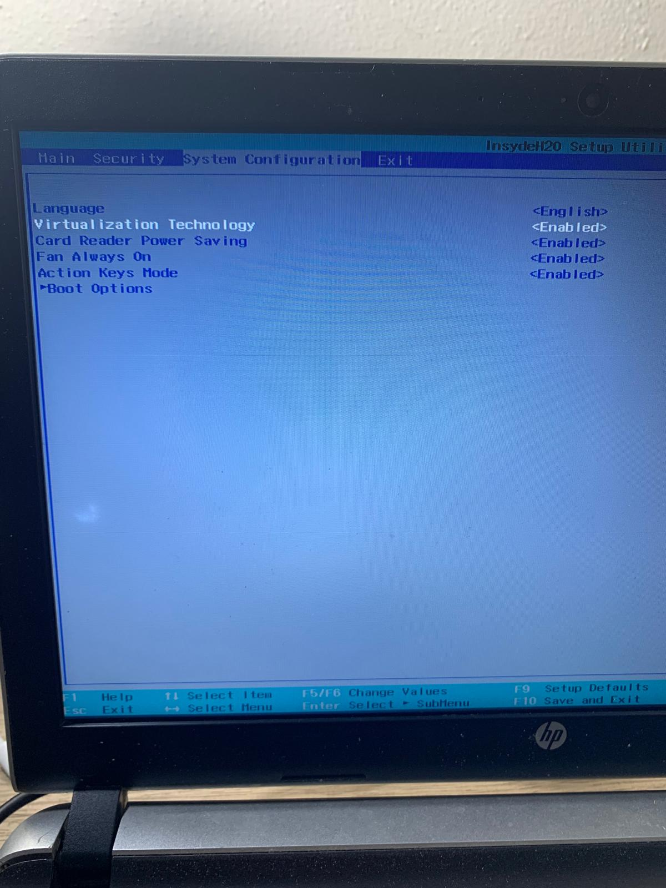
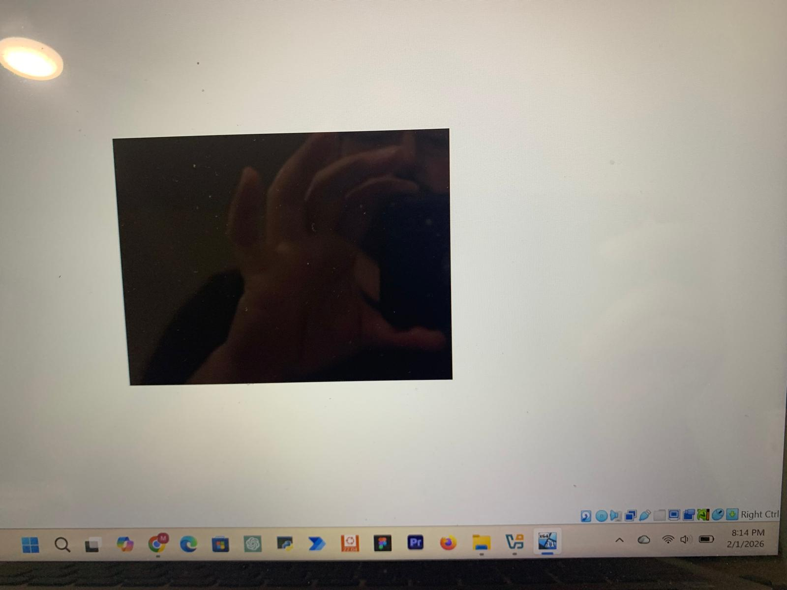
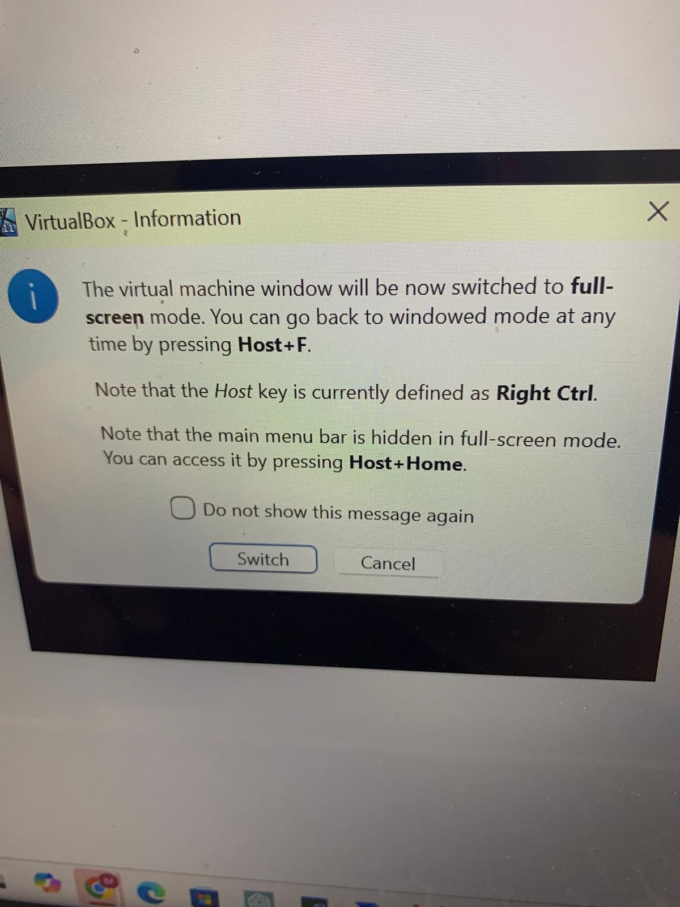
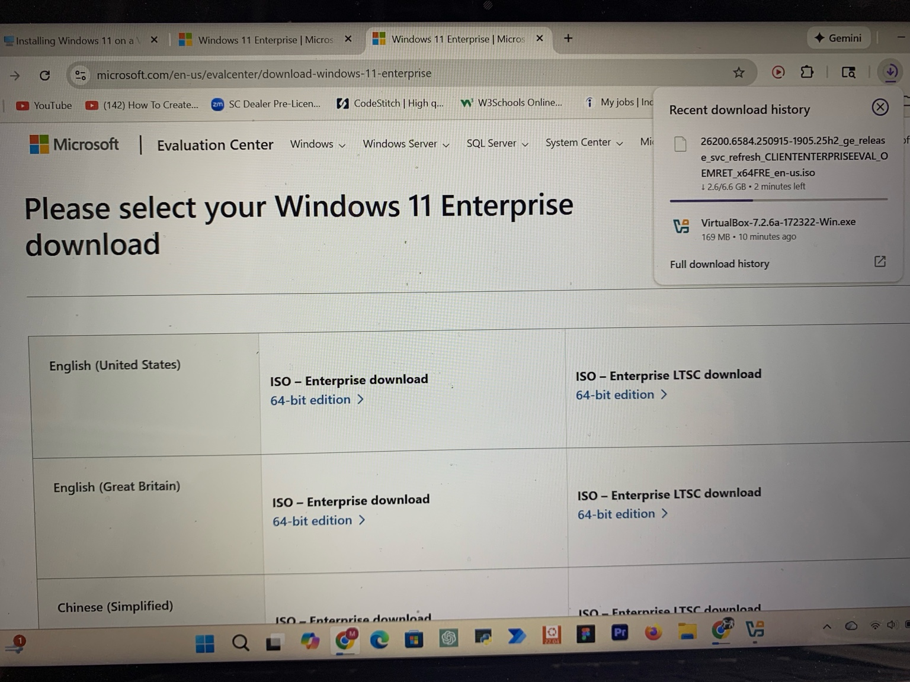
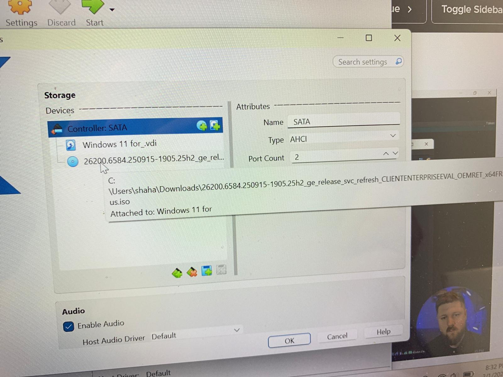
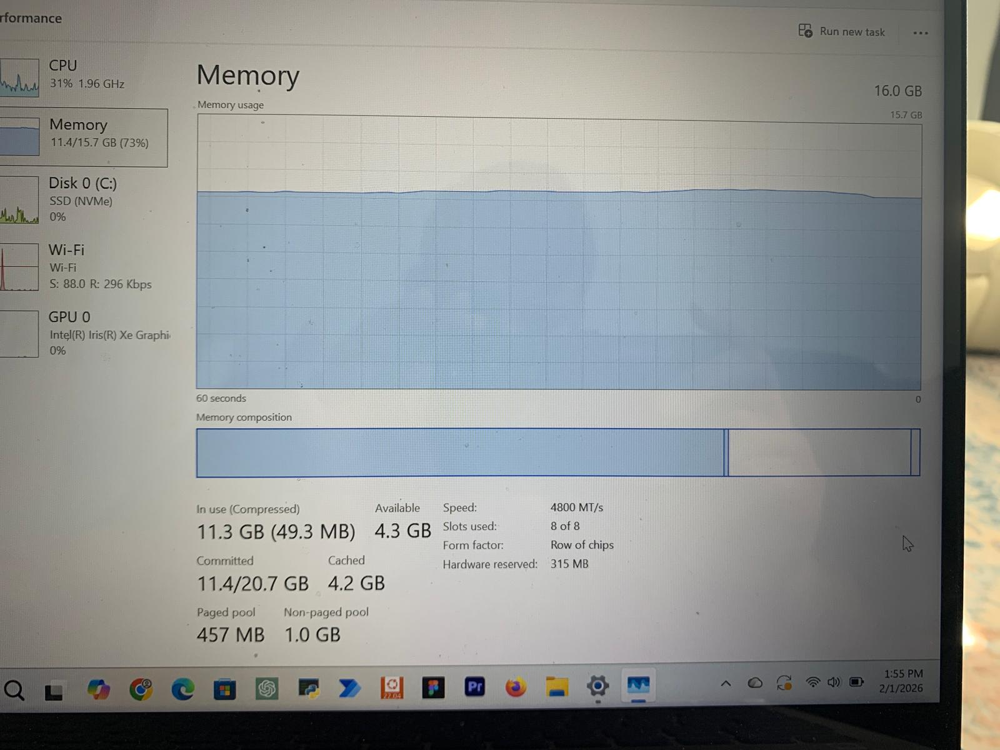
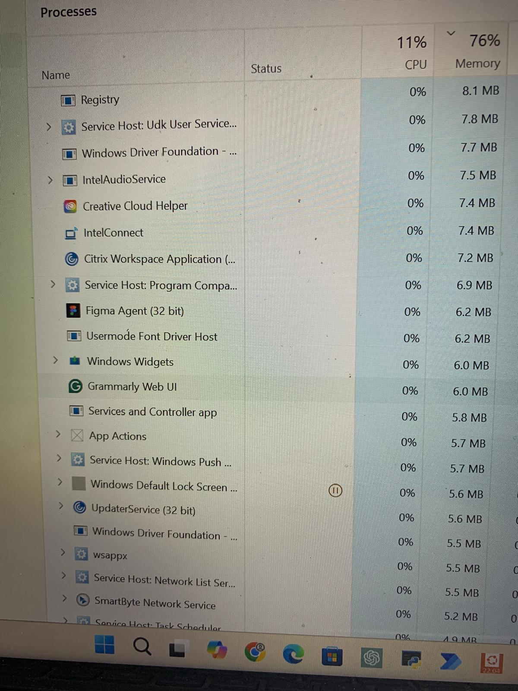
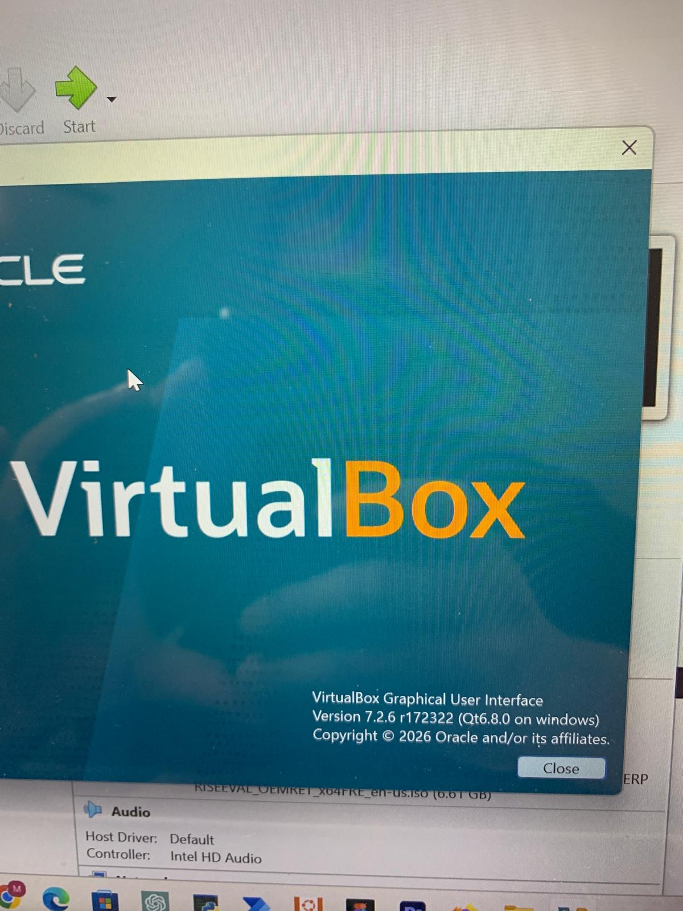

# Windows 11 Enterprise Active Directory Home Lab

## Project Overview

Built and troubleshot a Windows 11 Enterprise virtual machine using VirtualBox in preparation for an Active Directory home lab.

This project documents real-world virtualization conflicts and system-level troubleshooting involving Hyper-V, VBS, and Windows security features.

---

## Environment

- Host OS: Windows 11
- Hypervisor: VirtualBox 7.2.6
- VM OS: Windows 11 Enterprise Evaluation
- Hardware: NVMe SSD, 16GB RAM
- BIOS Virtualization: Enabled

---

## Problem 1 – Black Screen After VM Start

### Symptoms:
- VM launched but displayed black screen
- No Windows installer appeared
- VirtualBox appeared stuck

### Root Cause:
Conflict between VirtualBox and Windows Hyper-V / Virtual Machine Platform / VBS.

Windows was using its own hypervisor which prevented VirtualBox from fully controlling virtualization extensions.

---

## Problem 2 – Hyper-V / VBS Conflict

### Symptoms:
- VM would not boot correctly
- Inconsistent behavior
- Windows Features changes failed initially

### Investigation:
- Checked BIOS → Virtualization enabled
- Verified ISO attachment
- Adjusted chipset (PIIX3)
- Disabled Secure Boot
- Increased video memory (128MB)
- Checked Task Manager for resource usage

---

## Resolution Steps

1. Disabled **Virtual Machine Platform**
2. Disabled **Windows Hyper-V**
3. Disabled **Memory Integrity (Core Isolation)**
4. Rebooted system
5. Re-ran VM

After disabling VBS/Hyper-V conflicts, the VM booted successfully.

---

## Screenshots

### BIOS Virtualization Enabled

### Black Screen Issue

### Full Screen Hotkey Message

### ISO Download

### Storage Settings

### Task Manager - Disk Usage

### Task Manager - Memory Usage

### VirtualBox Version

---

## Skills Demonstrated

- Virtualization troubleshooting
- Hypervisor conflict resolution
- BIOS configuration
- Windows Feature management
- Resource monitoring and performance analysis
- Structured problem documentation

---

## Lessons Learned

- Windows 11 security features can conflict with third-party hypervisors
- VBS / Memory Integrity impacts virtualization performance
- Proper troubleshooting requires isolating one variable at a time
- Always verify ISO attachment and boot order first

---

## Next Steps

- Deploy Windows Server VM
- Install Active Directory Domain Services
- Configure Domain Controller
- Create users and Group Policies

